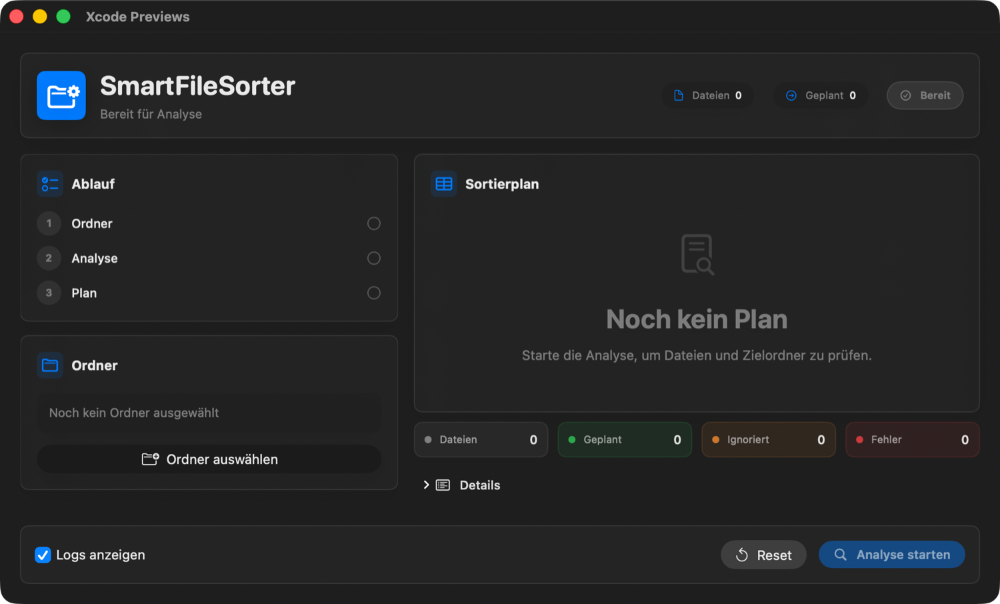

<div align="center">
  <h1>SmartFileSorter</h1>
  <p>
    A safety-first macOS product for analyzing folders, previewing file moves, and sorting files into clean categories.
  </p>
  <p>
    <strong>SwiftUI</strong> · <strong>macOS</strong> · <strong>Safe Mode</strong> · <strong>Local-first</strong>
  </p>
</div>

<br />

<div align="center">
  <table>
    <tr>
      <td align="center"><strong>Plan first</strong><br />Dry run is enabled by default.</td>
      <td align="center"><strong>Review moves</strong><br />Confirm the generated move list before files are touched.</td>
      <td align="center"><strong>Sort locally</strong><br />Files stay on your Mac. No cloud service required.</td>
    </tr>
  </table>
</div>

<br />

<div align="center">
  
</div>

## Overview

SmartFileSorter helps you clean up folders without the usual "wait, where did that file go?" feeling.

The product scans a selected folder, detects file categories, creates a safe sorting plan, and only moves files after explicit confirmation. It is designed for everyday folders like Downloads, Desktop exports, archive dumps, and messy project folders.

## Product Positioning

- **Who it's for:** freelancers, students, and creators who regularly clean chaotic local folders.
- **Core promise:** no hidden automation, no cloud dependency, no surprise data loss.
- **Primary use case:** clean up large mixed folders quickly while keeping full control of every move.

## Features

<table>
  <tr>
    <td width="50%">
      <h3>Safe Mode by default</h3>
      <p>The app starts with a planning flow. It generates a list of planned moves first, then asks for confirmation before actually moving files.</p>
    </td>
    <td width="50%">
      <h3>Category-based sorting</h3>
      <p>Files are grouped into clear destinations like Bilder, Dokumente, Archive, Audio, Videos, Apps, and Sonstiges.</p>
    </td>
  </tr>
  <tr>
    <td width="50%">
      <h3>Conflict handling</h3>
      <p>Name conflicts can be resolved automatically by creating numbered file names instead of overwriting existing files.</p>
    </td>
    <td width="50%">
      <h3>Activity log</h3>
      <p>The log keeps the sorting process visible, including detected files, planned moves, skipped files, and completed actions.</p>
    </td>
  </tr>
  <tr>
    <td width="50%">
      <h3>Focused macOS UI</h3>
      <p>The interface is built with SwiftUI and uses native macOS controls, system icons, and lightweight panels.</p>
    </td>
    <td width="50%">
      <h3>Configurable behavior</h3>
      <p>Ignore hidden files, skip subfolders, create missing folders, sort unknown files, and toggle logs from the settings panel.</p>
    </td>
  </tr>
</table>

## Safe Sorting Flow

<div>
  <ol>
    <li><strong>Select a folder</strong> that should be analyzed.</li>
    <li><strong>Start analysis</strong> to detect file categories.</li>
    <li><strong>Create a plan</strong> while Safe Mode is enabled.</li>
    <li><strong>Review the confirmation sheet</strong> with the planned move list.</li>
    <li><strong>Confirm the sort</strong> to move files into their category folders.</li>
  </ol>
</div>

## Categories

<table>
  <tr>
    <th>Category</th>
    <th>Folder</th>
    <th>Examples</th>
  </tr>
  <tr>
    <td>Bilder</td>
    <td><code>Bilder</code></td>
    <td><code>jpg</code>, <code>png</code>, <code>heic</code>, <code>webp</code>, <code>svg</code></td>
  </tr>
  <tr>
    <td>Dokumente</td>
    <td><code>Dokumente</code></td>
    <td><code>pdf</code>, <code>docx</code>, <code>txt</code>, <code>pages</code>, <code>xlsx</code></td>
  </tr>
  <tr>
    <td>Archive</td>
    <td><code>Archive</code></td>
    <td><code>zip</code>, <code>rar</code>, <code>7z</code>, <code>tar</code>, <code>gz</code></td>
  </tr>
  <tr>
    <td>Audio</td>
    <td><code>Audio</code></td>
    <td><code>mp3</code>, <code>m4a</code>, <code>wav</code>, <code>flac</code></td>
  </tr>
  <tr>
    <td>Videos</td>
    <td><code>Videos</code></td>
    <td><code>mp4</code>, <code>mov</code>, <code>mkv</code>, <code>webm</code></td>
  </tr>
  <tr>
    <td>Apps</td>
    <td><code>Apps</code></td>
    <td><code>app</code>, <code>dmg</code>, <code>pkg</code></td>
  </tr>
  <tr>
    <td>Sonstiges</td>
    <td><code>Sonstiges</code></td>
    <td>Unknown file types, if enabled in settings.</td>
  </tr>
</table>

## Tech Stack

<table>
  <tr>
    <td><strong>Language</strong></td>
    <td>Swift</td>
  </tr>
  <tr>
    <td><strong>UI</strong></td>
    <td>SwiftUI</td>
  </tr>
  <tr>
    <td><strong>State</strong></td>
    <td>Observation framework with <code>@Observable</code></td>
  </tr>
  <tr>
    <td><strong>Platform</strong></td>
    <td>macOS</td>
  </tr>
  <tr>
    <td><strong>Project</strong></td>
    <td>Xcode project</td>
  </tr>
</table>

## Getting Started

### Requirements

- macOS
- Xcode with SwiftUI support
- Git

### Run locally

```bash
git clone https://github.com/EmirCGN/SmartFileSorter.git
cd SmartFileSorter
open SmartFileSorter.xcodeproj
```

Then choose the `SmartFileSorter` scheme in Xcode and run the app.

You can also build from the terminal:

```bash
xcodebuild -project SmartFileSorter.xcodeproj \
  -scheme SmartFileSorter \
  -configuration Debug \
  -derivedDataPath /tmp/SmartFileSorterDerivedData \
  build
```

### Run smoke tests

```bash
./scripts/run_smoke_tests.sh
```

### Run unit tests

```bash
./scripts/run_unit_tests.sh
```

## Project Structure

```text
SmartFileSorter/
  App/
    AppState.swift
  Core/
    ConflictResolver.swift
    DirectoryScanner.swift
    FileAnalyzer.swift
    FileMover.swift
    FileSorter.swift
    RuleManager.swift
  Models/
    AppSettings.swift
    Category.swift
    FileItem.swift
    SortAction.swift
    SortSummary.swift
  Resources/
    DefaultRules.json
  Services/
    BookmarkService.swift
    FolderPickerService.swift
    LoggerService.swift
  ViewModels/
    MainViewModel.swift
  Views/
    ActivityLogView.swift
    CategoryOverviewView.swift
    FolderSelectionView.swift
    MainWindowView.swift
    SafeSortConfirmationView.swift
    SettingsPanelView.swift
    SummaryView.swift
```

## Roadmap

<table>
  <tr>
    <td><strong>Persistent undo history</strong></td>
    <td>Keep the latest undo session available across app restarts.</td>
  </tr>
  <tr>
    <td><strong>Custom rules</strong></td>
    <td>Create and manage your own categories, folder names, and extension sets.</td>
  </tr>
  <tr>
    <td><strong>Duplicate detection</strong></td>
    <td>Detect identical files before moving and offer safe actions.</td>
  </tr>
  <tr>
    <td><strong>Packaging and updates</strong></td>
    <td>Add signed releases, notarization, and in-app update delivery.</td>
  </tr>
  <tr>
    <td><strong>Automated tests</strong></td>
    <td>Ship unit and integration tests for rules, conflict resolution, scanning, and moving.</td>
  </tr>
</table>

## Privacy

SmartFileSorter is local-first. Folder analysis and sorting happen on your machine.

See the full policy in [PRIVACY.md](PRIVACY.md).

## Terms

See [TERMS.md](TERMS.md).

## License

This project is licensed under the MIT License. See [LICENSE](LICENSE).
